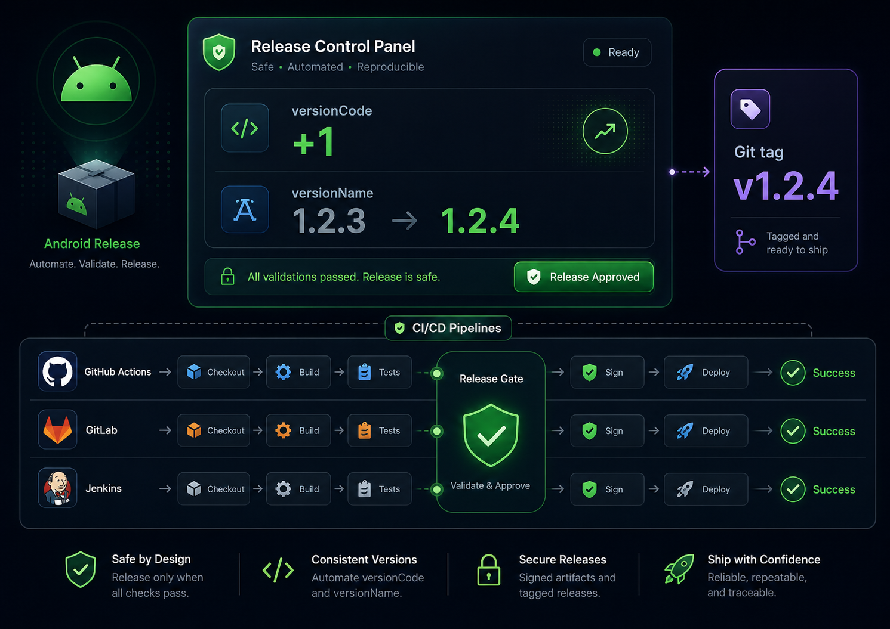

# Android CI/CD Release Skill

<p align="center">
  <a href="./README.md"></a>
  <a href="./README.ko.md"></a>
</p>

<p align="center">
  
</p>

기존 CI/CD 릴리스 자동화가 있는 Android 레포에서 버전 변경과 태그 기반 배포를 안전하게 준비하도록 돕는 Codex 스킬입니다.

이 스킬은 또 하나의 버전 관리 플러그인이나 GitHub Action이 아닙니다. Codex가 레포를 먼저 검사하고, 기존 릴리스 관례를 읽고, `versionName`을 추론해야 할 때 사용자 확인을 받은 뒤, 레포의 CI/CD 스크립트가 태그 푸시를 배포 트리거로 사용한다는 근거가 있을 때만 커밋, 푸시, 릴리스 태그 생성을 진행하게 하는 워크플로 가드레일입니다.

## 왜 만들었는가

Android 릴리스 버전 변경은 작은 수정처럼 보이지만 실패 비용이 큽니다.

- `versionCode`는 매 릴리스마다 계속 증가해야 합니다.
- `versionName`은 사용자에게 보이는 값이고 팀별 관례를 따르는 경우가 많습니다.
- 태그 푸시는 실제 배포 파이프라인을 실행할 수 있습니다.
- 레포마다 릴리스 규칙을 CI/CD에 표현하는 방식이 조금씩 다릅니다.

기존 도구는 보통 한 계층만 자동화합니다. Gradle 파일을 수정하는 GitHub Action, Git 태그에서 버전을 계산하는 Gradle 플러그인, Fastlane lane 같은 방식입니다. 이 스킬은 그런 도구들이 이미 있는 레포에서, Codex가 추측하지 않고 현재 CI/CD와 Git 히스토리를 따라가야 할 때 유용합니다.

## 차별점

- CI/CD 설정이 없는 레포에서는 실행하지 않습니다.
- 파일을 수정하기 전에 dry-run 점검 리포트부터 확인합니다.
- `versionName`을 추론해야 하면 반드시 사용자 확인을 받습니다.
- Git 히스토리에서 기존 릴리스 커밋과 태그 관례를 맞춥니다.
- CI/CD 파일에서 태그 기반 릴리스 경로가 확인될 때만 태그를 푸시합니다.
- GitHub Actions, GitLab CI, Jenkins, CircleCI, Buildkite, Drone, Bitbucket Pipelines, Azure Pipelines, Codemagic 등을 특정 플랫폼 강제가 아니라 레포 안의 근거 기반으로 다룹니다.

## 설치

레포를 클론한 뒤 스킬 폴더를 Codex skills 디렉터리에 복사합니다.

```bash
git clone https://github.com/gay00ung/android-cicd-release-skill.git
cd android-cicd-release-skill
mkdir -p "${CODEX_HOME:-$HOME/.codex}/skills"
cp -R skill/android-cicd-release "${CODEX_HOME:-$HOME/.codex}/skills/"
```

새 Codex 세션을 시작한 뒤 이렇게 호출합니다.

```text
Use $android-cicd-release to release this Android app.
```

목표 버전을 직접 지정할 수도 있습니다.

```text
Use $android-cicd-release to bump this Android app to 2.0.0 and release it.
```

## 안전 모델

이 스킬은 아래 조건이 충족되지 않으면 Codex가 편집 전에 멈추도록 지시합니다.

- 현재 디렉터리가 Git 레포여야 합니다.
- CI/CD 설정 파일이 있어야 합니다.
- 워크트리가 깨끗해야 합니다.
- `main`을 fetch하고 fast-forward 할 수 있어야 합니다.
- Android 버전 선언이 모호하지 않아야 합니다.
- CI/CD의 릴리스 트리거가 이해되어야 합니다.

사용자가 목표 `versionName`을 지정하지 않으면 Codex는 먼저 확인해야 합니다.

```text
현재 versionName을 1.0.0에서 1.0.1로 올려도 될까요?
```

## 레포 수동 점검

번들된 스크립트는 파일을 수정하지 않습니다. 릴리스 준비 상태만 요약합니다.

```bash
skill/android-cicd-release/scripts/inspect_android_cicd_release.py --require-ci /path/to/android-repo
```

JSON 출력:

```bash
skill/android-cicd-release/scripts/inspect_android_cicd_release.py --json /path/to/android-repo
```

## 리서치 노트

유사 도구 조사와 포지셔닝은 [docs/research.md](docs/research.md)에 정리되어 있습니다.

요약:

- Android 공식 문서는 `versionCode`가 단조 증가해야 하며, `versionName`은 사용자에게 표시되는 버전 문자열이라고 설명합니다.
- GitHub Actions와 GitLab CI는 모두 태그 기반 워크플로/파이프라인을 지원합니다.
- 기존 Android 버전 bump Action이나 Gradle 플러그인은 유용하지만, 보통 프로젝트에 통합해야 하며 보수적으로 레포 히스토리를 읽는 릴리스 오퍼레이터 역할을 하지는 않습니다.

## 테스트

서드파티 Python 패키지는 필요하지 않습니다.

```bash
python3 -m unittest discover -s tests
```

## 레포 구조

```text
.
├── assets/                       # README 이미지
├── skill/android-cicd-release/   # 설치 가능한 Codex 스킬
├── tests/                        # 스크립트 회귀 테스트와 fixture
├── docs/research.md              # 유사 도구 조사와 포지셔닝
├── README.md
└── README.ko.md
```
